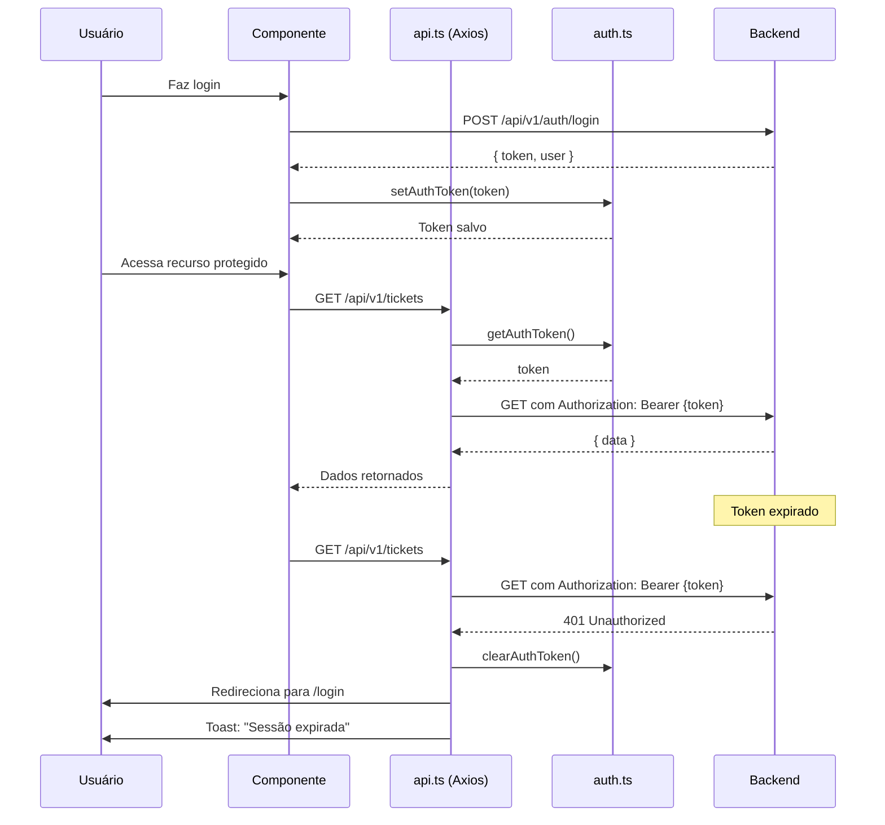
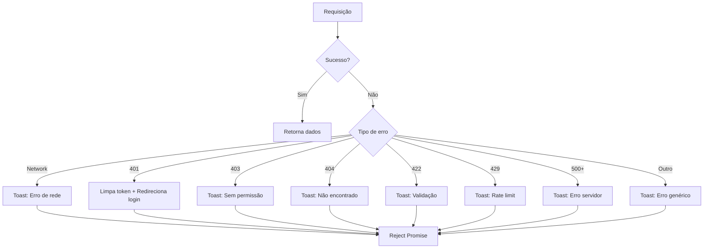

# Biblioteca de Utilitários - Frontend Callsoft

## Arquivos

### `api.ts`
Cliente HTTP configurado com Axios e interceptors.

**Características**:
- Base URL: `http://localhost:64231` (configurável via `NEXT_PUBLIC_API_BASE_URL`)
- Timeout: 30 segundos
- Interceptors automáticos para autenticação e tratamento de erros

**Request Interceptor**:
- Adiciona automaticamente o token JWT no header `Authorization: Bearer <token>`
- Verifica se está em ambiente browser (evita erros em SSR)
- Usa o helper `getAuthToken()` para obter o token

**Response Interceptor**:
Trata todos os erros HTTP de forma global:
- **Network Error**: Exibe toast de erro de rede
- **401 Unauthorized**: Remove token, redireciona para login, exibe toast
- **403 Forbidden**: Exibe toast de permissão negada
- **404 Not Found**: Exibe toast de recurso não encontrado
- **422 Validation Error**: Exibe toast com mensagem de validação do backend
- **429 Rate Limit**: Exibe toast de muitas requisições
- **500+ Server Error**: Exibe toast de erro no servidor
- **Outros erros**: Exibe toast genérico com mensagem do backend

**Logs**:
- Erros são logados no console apenas em ambiente de desenvolvimento
- Produção não exibe logs sensíveis

**Uso**:
```typescript
import { api } from '@/lib/api';

// GET
const response = await api.get('/api/v1/tickets');

// POST
const response = await api.post('/api/v1/tickets', data);

// PUT
const response = await api.put('/api/v1/tickets/123', data);

// DELETE
const response = await api.delete('/api/v1/tickets/123');
```

---

### `auth.ts`
Helpers para gerenciamento de autenticação e tokens JWT.

**Funções**:

#### `getAuthToken(): string | null`
Obtém o token JWT do localStorage.
- Retorna `null` se não estiver em ambiente browser (SSR)
- Retorna `null` se não houver token

#### `setAuthToken(token: string): void`
Armazena o token JWT no localStorage.
- Verifica se está em ambiente browser antes de salvar

#### `clearAuthToken(): void`
Remove o token JWT do localStorage.
- Usado no logout e em erro 401

#### `isAuthenticated(): boolean`
Verifica se há um token armazenado.
- Não valida se o token é válido, apenas se existe

#### `getUserFromToken(): User | null`
Decodifica e extrai os dados do usuário do token JWT.
- Retorna objeto `User` com id, name, email, role, permissions
- Retorna `null` se token inválido ou não encontrado
- Trata erros de parsing automaticamente

#### `isTokenExpired(): boolean`
Verifica se o token JWT está expirado.
- Lê o campo `exp` do payload JWT
- Compara com timestamp atual
- Retorna `true` se expirado ou inválido

**Uso**:
```typescript
import {
  getAuthToken,
  setAuthToken,
  clearAuthToken,
  isAuthenticated,
  getUserFromToken,
  isTokenExpired
} from '@/lib/auth';

// Login
setAuthToken(tokenFromBackend);

// Verificar autenticação
if (isAuthenticated() && !isTokenExpired()) {
  const user = getUserFromToken();
  console.log(user?.name);
}

// Logout
clearAuthToken();
```

---

### `toast.ts`
Utilitário para exibir notificações toast temporárias.

**Funções**:

#### `toast.success(message: string, title?: string)`
Exibe toast de sucesso (verde).
- Título padrão: "Sucesso"

#### `toast.error(message: string, title?: string)`
Exibe toast de erro (vermelho).
- Título padrão: "Erro"

#### `toast.warning(message: string, title?: string)`
Exibe toast de aviso (amarelo).
- Título padrão: "Atenção"

#### `toast.info(message: string, title?: string)`
Exibe toast de informação (azul).
- Título padrão: "Informação"

**Características**:
- Auto-hide após 5 segundos
- Animação de entrada suave
- Posicionado no canto superior direito
- Pode exibir múltiplos toasts simultaneamente
- Usa o notification store do Zustand

**Uso**:
```typescript
import { toast } from '@/lib/toast';

// Sucesso
toast.success('Ticket criado com sucesso!');

// Erro
toast.error('Erro ao criar ticket', 'Ops!');

// Aviso
toast.warning('Preencha todos os campos obrigatórios');

// Info
toast.info('Você tem 3 tickets pendentes');
```

---

## Fluxo de Autenticação



---

## Fluxo de Tratamento de Erros



---

## Configuração de Ambiente

Certifique-se de ter estas variáveis em `.env.local`:

```bash
# Base URL da API
NEXT_PUBLIC_API_BASE_URL=http://localhost:64231

# Ambiente
NEXT_PUBLIC_ENV=development
```

---

## Notas de Implementação

### SSR (Server-Side Rendering)
Todos os helpers verificam `typeof window !== "undefined"` antes de acessar `localStorage` para evitar erros durante SSR do Next.js.

### Segurança
- Tokens são armazenados em localStorage (não em cookies por simplicidade)
- Em produção, considere usar httpOnly cookies para maior segurança
- Logs sensíveis são exibidos apenas em desenvolvimento

### Performance
- Interceptors são executados em todas as requisições
- Cache de React Query deve ser usado para minimizar requisições

### Testes
Para testar os interceptors:
1. Faça login normalmente
2. Inspecione localStorage para ver o token
3. Tente acessar um recurso protegido (deve funcionar)
4. Remova o token manualmente do localStorage
5. Tente acessar novamente (deve redirecionar para login)

---

## Próximos Passos

Esta é a implementação da **Task 3** do projeto de integração. As próximas tasks serão:
- **Task 4**: Configuração do React Query
- **Task 5**: Estrutura base de Services e Hooks
- **Task 6+**: Implementação dos módulos (Auth, Tickets, Cotações, etc.)
